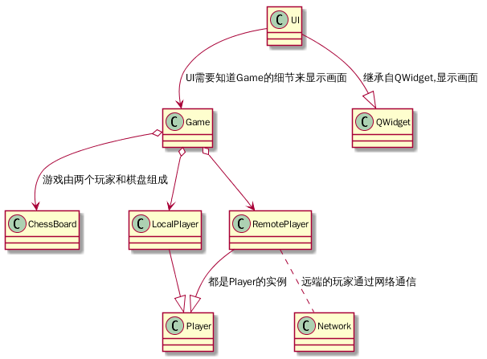

# 五子棋(Five In Raw)

# 编译
项目使用QT进行开发

开发环境:QT 5.12 + Debian9.6 + GCC 6.3  
windows下暂未测试  

编译时:
```
> cd FiveInRaw
> qmake
> make
> ./out/fir
```

项目结构如下:


类的职责:
* Game类.  
负责整局游戏的所有具体实现.包括不限于如下所示:
   1. 开始游戏
   1. 判断游戏结束(和局或胜负局)
   1. 落子(玩家只能申请落子,具体行为由Game类负责)
   1. 悔棋(A玩家申请悔棋,B玩家同意悔棋,则由Game类完成回滚操作.)
   1. 校验(负责对所有的操作进行校验,防止作弊,具体手段见[防作弊功能](#nocheat))
* Player类  
对玩家的抽象,向Game提出各种操作的申请,包括如下功能:
   1. 申请落子
   1. 申请悔棋
   1. 申请和棋
   1. 和远端用户建立连接,代替另一用户在本地申请落子.
* 棋盘类  
对棋盘的抽象,只含有一个二位数组,使用枚举来表示交叉点的落子情况.
* UI类  
客户端专属类,将Game中的棋盘显示出来,完成本地玩家的交互.

